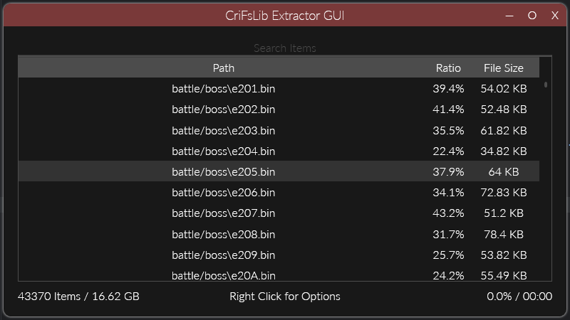

CriFsV2Lib Reloaded
===========

A minimal library to extract contents from CRI Middleware's CPK archive format. (a.k.a. CRI Filemajik library)

Goals:  
- Clean codebase.  
- Minimalist.  (does minimal amount of work)
- No dependencies.  (entirely self contained in ~25KB library)
- High performance.  (really, really fast)

I wrote this library for my personal needs (i.e. for use with [CriFs.V2.Hook](https://github.com/Sewer56/CriFs.V2.Hook.ReloadedII) extensions).  
Does not support packing/repacking; if you need that functionality, fire a pull request 😇.  

What this library isn't:  
- General CRI Table Parser  (it skips any data it doesn't care about)

Feature Support
===============

- Decompression (CRILayla).  
- Header Decryption.  
- Custom User Decryption Functions.  



A basic standalone WPF application is also available for testing.

Usage
=====

High Level API is available in the `CpkHelper` class.  

## Get File Info  
```csharp
using var fileStream = new FileStream(Assets.SampleCpkFile, FileMode.Open);
var files = CpkHelper.GetFilesFromStream(fileStream);
```

## Extract Individual File  
```csharp
using var file = CpkHelper.ExtractFile(files[0], fileStream)
// Access via file.Span
```

You can pass in optional decryption function.  
Lower level APIs will require partial understanding of the formats, have a look at the tests project.  

## Extract Files in Batch

The batch extractor can be used to efficiently extract multiple files in a multithreaded fashion.  
⚠️ Uses heavy array pooling, risk of address space starvation in 32-bit processes!!  

```csharp
using var extractor = new BatchFileExtractor<ItemModel>(CpkPath);
for (int x = 0; x < files.Length; x++)
    extractor.QueueItem(new CpkFileExtractorItemModel(Path.Combine(folder, files[x].FullPath), files[x]));

extractor.WaitForCompletion();
```

## Clearing Memory

❗ The library makes use of array pooling to speed up operations.  

Once you are done with using the library, consider clearing the array pool:  
```csharp
ArrayRental.Reset();
```

This will clear the pool, allowing the memory to be freed.  

📝 You might notice a large Private Working Set (RAM Usage) in Task Manager persisting for a while when running with GC Regions (.NET 7).  
*This is as intended and is not something you should be worried about*.  

This memory of the UOH (LOH and POH) will be fully decommitted when the GC sees fit, (usually after next Gen 2 GC or when a low RAM notification is received from the OS).  

If this however still bothers you, or you know you're not going to use the library again, request a GC with pressure:  
```csharp
GCSettings.LargeObjectHeapCompactionMode = GCLargeObjectHeapCompactionMode.CompactOnce;
GC.AddMemoryPressure(int.MaxValue);
GC.Collect(); // will clean up LOH
GC.RemoveMemoryPressure(int.MaxValue);
// Memory will be fully decommitted shortly after this line (next GC of any kind)
```

Performance
===========

Some parts of this library are heavily tuned for performance. 

Decompression (CRILayla, 165KiB Model file):  
```
BenchmarkDotNet=v0.13.2, OS=Windows 10 (10.0.19044.2130/21H2/November2021Update)
Intel Core i7-4790K CPU 4.00GHz (Haswell), 1 CPU, 8 logical and 4 physical cores
.NET SDK=7.0.100
  [Host]     : .NET 7.0.0 (7.0.22.51805), X64 RyuJIT AVX2
  DefaultJob : .NET 7.0.0 (7.0.22.51805), X64 RyuJIT AVX2

|   Method |     Mean |    Error |  StdDev | Ratio |    Gen0 |    Gen1 |    Gen2 | Allocated | Alloc Ratio |
|--------- |---------:|---------:|--------:|------:|--------:|--------:|--------:|----------:|------------:|
|   CriPak | 983.3 us | 11.02 us | 9.77 us |  1.00 | 50.7813 | 50.7813 | 50.7813 | 166.01 KB |        1.00 |
| CriFsLib | 355.4 us |  3.20 us | 2.83 us |  0.36 | 52.2461 | 52.2461 | 52.2461 | 165.71 KB |        1.00 |
```

Header decryption/descramble [2MB Header]:  
```
|           Method |        Mean |    Error |   StdDev | Ratio |     Gen0 |     Gen1 |     Gen2 | Allocated | Alloc Ratio |
|----------------- |------------:|---------:|---------:|------:|---------:|---------:|---------:|----------:|------------:|
|           CriPak | 1,851.23 us | 6.343 us | 5.623 us |  1.00 | 294.9219 | 294.9219 | 294.9219 | 2097269 B |        1.00 |
|         CriFsLib |   529.34 us | 3.844 us | 3.407 us |  0.29 | 331.0547 | 331.0547 | 331.0547 | 2097280 B |        1.00 |
| CriFsLib_InPlace |    87.06 us | 1.241 us | 1.161 us |  0.05 |        - |        - |        - |         - |        0.00 |
```
Is approximately 15 times faster than the in retail CRI games.


Parsing a 30GB encrypted/scrambled CPK with 45000 files:  
```csharp
|     Method |     Mean |     Error |    StdDev |     Gen0 |     Gen1 |     Gen2 | Allocated |
|----------- |---------:|----------:|----------:|---------:|---------:|---------:|----------:|
| ParseTable | 8.469 ms | 0.1660 ms | 0.3276 ms | 984.3750 | 968.7500 | 546.8750 |   6.44 MB |
```

[`CriPak` is the reference implementation from [CriPakTools](https://github.com/wmltogether/CriPakTools)].  

In practice, this library is always I/O (/FileSystem) bottlenecked.  
6 cores of a modern CPU should be sufficient to saturate a modern NVMe SSD ()>3GB/s disk speed).  

Resources
=====

This code is based on the following previous projects.  

- Skyth (https://github.com/blueskythlikesclouds/MikuMikuLibrary/blob/dotnet/MikuMikuLibrary/Archives/CriMw/UtfTable.cs)  
- TGE (https://github.com/tge-was-taken/010-Editor-Templates/blob/master/releases/cri_archives/cri_archives_rel_1.bt)  
- CriPakTools by Falo, Nanashi3, esperknight, uyjulian & wmltogether (https://github.com/wmltogether/CriPakTools)

Building
=========
- Install .NET 7 SDK.
- Build with `dotnet build -c Release` 
or if you prefer an IDE, just open `CriFsV2Lib.sln`.

Credits
=========

- Aforementioned authors in 'Resources' section.  
- Sano Shin'ichirou, yeah321: Cultured unit test data for decompression testing.  [Small Extract from Visual Novel.]  
- Lipsum/Zarroboogs (Original P5R Encryption function for reference)